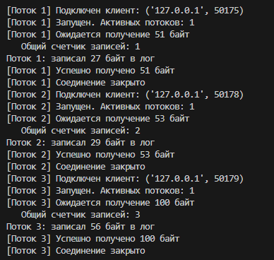

# Практическая работа 4: Синхронизация потоков и работа с общими ресурсами в распределенных системах

---
**Дисциплина:** Распределенные системы\
**Выполнил:** Верещак Д.Д\
**Группа:** 23-ПИ-01\
**Преподаватель:** Алешин Александр Владимирович

---
## Описание проекта
Данный проект реализует многопточный TCP-сервер на языке Python с использованием библиотеки threading, обеспечивающий конкурентный доступ к общему файловому ресурсу. Сервер принимает текстовые файлы от нескольких клиентов одновременно их содержимое в общий файл лога. Для предотвращения состояния гонки (Race Condition) применен механизм блокировок threading.Lock() с использованием контекстных менеджеров.

---
## Цель работы
Научиться обеспечивать целостность данных при конкурентном доступе к общим ресурсам (файлам) в многопоточном сетевом приложении.

```
├── Server.py          # Серверная часть
├── Client.py          # Клиентская часть
├── README.md          # Документация
└── screenshots/       # Папка для скриншотов
└── server_storage.txt # Общий файл лога (создается автоматически)
└── Тестовые файлы/ # Папка с тестовыми файлами
```

---
## Технологический стек
- **Python 3.10+**
- **TCP (stream sockets)**
- **Многопоточный режим работы (threading)**
- **Механизм синхронизации: threading.Lock()**
- **Контекстные менеджеры (with lock:)**
- **Общий счетчик записей**
- **Имитация задержки внутри критической секции**
- **Хост: 127.0.0.1**
- **Порт: 12345**
- **Кодировка UTF-8**
- **Библиотеки: socket, threading, time, datetime**

---
## Инструкция по запуску
**Шаг 1: Проверка установленной версии Python**

**Откройте терминал (командную строку) и выполните:**
```
python --version
```
**Шаг 2: Запуск сервера**
1. Откройте первый терминал
2. Перейдите в папку с проектом
3. Запустите сервер:
```
python Server.py
```
Сервер перейдет в режим ожидания подключения:
```
Сервер запущен на 127.0.0.1:12345
Общий лог-файл: server_storage.txt
Используется блокировка: threading.Lock() с контекстным менеджером
Ожидание подключений... (Ctrl+C для остановки)
```

**Шаг 3: Запуск клиента (-ов)**
1. Откройте второй терминал
2. Перейдите в папку с проектом
3. Запустите клиента:
```
python Client.py
```

Клиент подключится к серверу:
```
=== КЛИЕНТ ДЛЯ ОТПРАВКИ ФАЙЛОВ НА СЕРВЕР ===

1. Отправить файл
2. Выход
Выберите действие:
```

**Шаг 4: Подготовка тестового файла**
Создайте текстовый файл, например test_file.txt, с произвольным содержимым:
```
Привет, дружочек-пирожочек!

```

**Шаг 5: Отправка файла**
1. В окне клиента выберите действие 1
2. Введите путь к файлу: Тестовые файлы/test_file.txt
3. Наблюдайте за выводом:

**Клиент:**
```
Отправка файла 'Тестовые файлы/test_file.txt' на сервер 127.0.0.1:12345
Размер данных: 51 байт
Ответ сервера: OK: File received and logged
```
**Сервер:**
```
[Поток 1] Подключен клиент: ('127.0.0.1', 36380)
[Поток 1] Ожидается получение 51 байт
[Поток 1] Запущен. Активных потоков: 1
   Общий счетчик записей: 1
```

**Шаг 6: Завершение работы**

**Для завершения сеанса пишем цифру 2 (Выход)**
```
2. Выход
```
**Оба приложения закроют соединения и завершат работу.**

---

## Скриншоты работы
**Сервер**



**Клиент 1**


**Клиент 2**


**Клиент 3**


